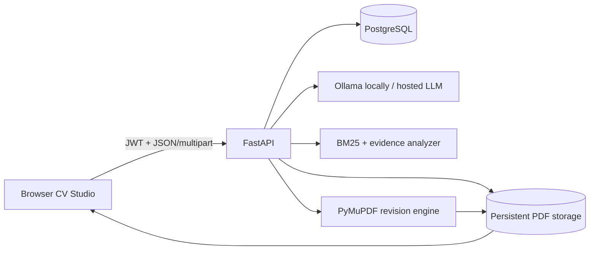

# Unibot Resume Agent

Unibot is an AI-assisted placement-CV studio that imports an existing resume, preserves its PDF appearance, evaluates job relevance transparently, proposes contextual edits, and regenerates an approved PDF revision.

> Live application: **deployment pending provider credentials**. This line will be replaced with the verified production URL after deployment.

## Product capabilities

- One-click guest workspace plus JWT registration/login APIs.
- PDF, DOCX, TXT, and JSON resume import.
- Exact PDF-page rendering with selectable text overlays.
- Whole-line click selection or character-level drag selection.
- Local Ollama development model or any OpenAI-compatible hosted model.
- Clarifying questions for vague prompts.
- Proposal-first workflow: AI suggestions never alter the source until explicitly approved.
- PDF replacement that preserves bold styling where detected.
- Whole-CV commands such as `Add PostgreSQL to skills` with section routing.
- Download, undo, reset-to-original, and revision history.
- Transparent ATS-readiness formula with BM25 relevance, evidence quality, and structural checks.
- ATS missing-term suggestions staged for review before any source-PDF update.
- Multi-tenant SQL persistence: SQLite locally and PostgreSQL in production.

## ATS methodology

No universal “ATS score” exists because hiring platforms use proprietary parsers and ranking configurations. Unibot reports a reproducible **ATS-readiness estimate**:

| Component | Weight | Purpose |
|---|---:|---|
| BM25 job relevance | 70% | Saturated term relevance between the CV and job description |
| Evidence quality | 20% | Action-led and quantified achievement lines |
| Resume structure | 10% | Presence of education, experience, skills, and projects |

The relevance component follows Robertson and Zaragoza’s BM25 framework. Occupation and skills terminology references the U.S. Department of Labor-sponsored O*NET content model. These sources are also linked inside every UI report.

- [The Probabilistic Relevance Framework: BM25 and Beyond](https://doi.org/10.1561/1500000019)
- [O*NET Content Model](https://www.onetcenter.org/content.html)

## Architecture



Detailed architecture, security boundaries, state transitions, and failure modes are documented in [docs/MASTER_DOCUMENT.md](docs/MASTER_DOCUMENT.md).

## Local development

Requirements: Python 3.12+ and optionally Ollama with `llama3:latest`.

```powershell
git clone https://github.com/Samik123Mit/unibot-resume-agent.git
cd unibot-resume-agent
Copy-Item .env.example .env
python -m venv .venv
.\.venv\Scripts\Activate.ps1
pip install -r requirements.txt
uvicorn app.main:app --reload --port 8001
```

Open `http://127.0.0.1:8001`.

Run tests:

```powershell
pytest -q
```

## Environment variables

| Variable | Required | Description |
|---|---|---|
| `DATABASE_URL` | Production | SQLAlchemy URL; use PostgreSQL in deployment |
| `JWT_SECRET` | Production | Long random signing secret |
| `ACCESS_TOKEN_EXPIRE_MINUTES` | No | Session lifetime; default `10080` |
| `UPLOAD_DIR` | Production | Persistent mounted directory for PDF revisions |
| `LLM_API_BASE` | Cloud AI | OpenAI-compatible API base URL |
| `LLM_API_KEY` | Cloud AI | Provider secret; never expose to the browser |
| `LLM_MODEL` | Cloud AI | Hosted model identifier |
| `OLLAMA_MODEL` | Local only | Defaults to `llama3:latest` |

The server falls back to local Ollama when hosted-provider variables are absent. A cloud deployment must configure a hosted model because it cannot reach a developer machine’s Ollama service.

## Deployment

The repository includes:

- `Dockerfile` for deterministic container builds.
- `render.yaml` for a web service, managed PostgreSQL, and persistent PDF disk.
- `.github/workflows/ci.yml` for automated tests.
- `docker-compose.yml` for local PostgreSQL integration.

See [docs/DEPLOYMENT.md](docs/DEPLOYMENT.md) for rollout, secrets, smoke tests, backups, and rollback.

## API overview

| Area | Endpoints |
|---|---|
| Session | `/api/auth/guest`, `/api/auth/register`, `/api/auth/login`, `/api/me` |
| Resumes | `/api/resumes`, `/api/resumes/import`, `/api/resumes/{id}` |
| AI review | `/selection-edit`, `/apply-selection`, `/command` |
| ATS | `/ats` |
| PDF | `/preview`, `/pdf-layout`, `/pdf-page/{page}` |
| Recovery | `/undo`, `/reset`, `/revisions` |

Interactive OpenAPI documentation is available at `/docs` while the API runs.

## Test status

The suite covers tenant isolation, ATS output, proposal/approval behavior, vague-prompt clarification, exact PDF replacement, whole-CV PDF updates, and bold-style preservation. See [docs/TESTING.md](docs/TESTING.md) for the complete matrix.

## Safety and limitations

- Missing ATS keywords should be added only when they truthfully represent the candidate.
- The original PDF and extracted source text are retained for recovery.
- Scanned PDFs without a text layer require OCR before exact replacement.
- A substantially longer replacement can overflow the original text box; concise suggestions are preferred.
- Hosted production AI requires a server-side provider key.

## Documentation

- [Master technical document](docs/MASTER_DOCUMENT.md)
- [System architecture](docs/ARCHITECTURE.md)
- [Testing strategy and cases](docs/TESTING.md)
- [Deployment and operations](docs/DEPLOYMENT.md)

## License

No open-source license has been selected. All rights remain with the repository owner until a license is added.
