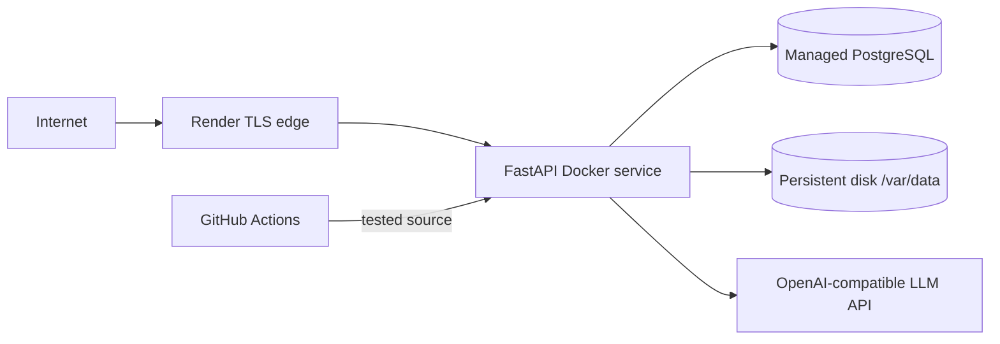
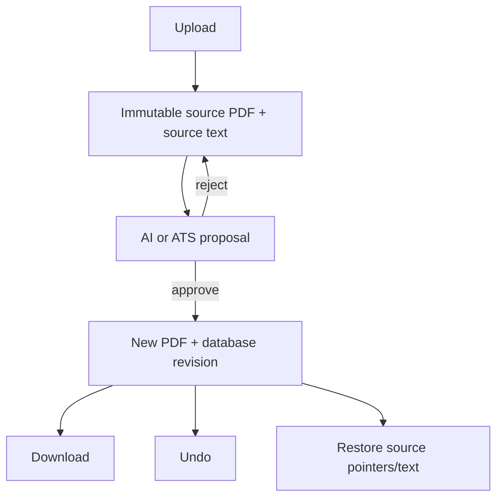

# System Architecture

## Deployment topology

## Trust boundaries

| Boundary | Controls |
|---|---|
| Browser → API | Bearer JWT, request validation, upload limits |
| API → database | Parameterized SQLAlchemy queries, ownership predicates |
| API → PDF storage | Internal paths only; authenticated download/render endpoints |
| API → LLM | Server-side secret, constrained prompt, proposal-before-apply |
| User → AI mutation | Clarification and explicit approval gate |

## Component responsibilities

- **Browser:** upload, exact page display, selectable overlay, review/approval, download.
- **FastAPI:** authentication, tenancy, orchestration, validation and OpenAPI.
- **SQLAlchemy/PostgreSQL:** users, resume state and revision records.
- **PDF engine:** text localization, style-aware replacement, rendering and revision output.
- **LLM adapter:** local Ollama development or hosted OpenAI-compatible inference.
- **ATS analyzer:** deterministic BM25/evidence/structure calculation.

## Data lifecycle

See [MASTER_DOCUMENT.md](MASTER_DOCUMENT.md) for detailed flows and decisions.
