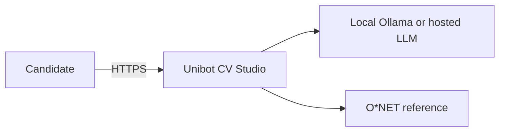
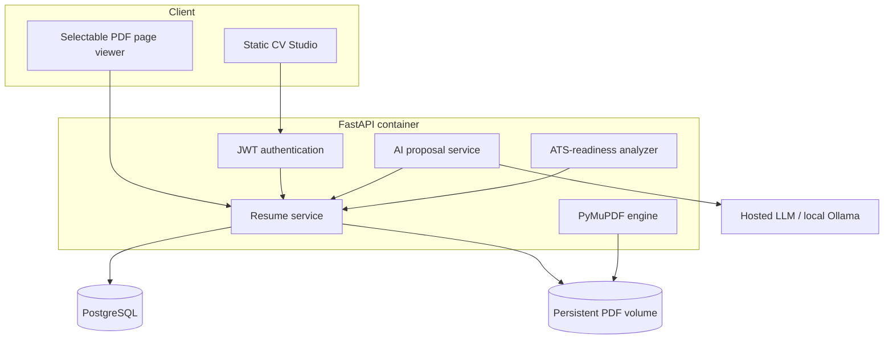
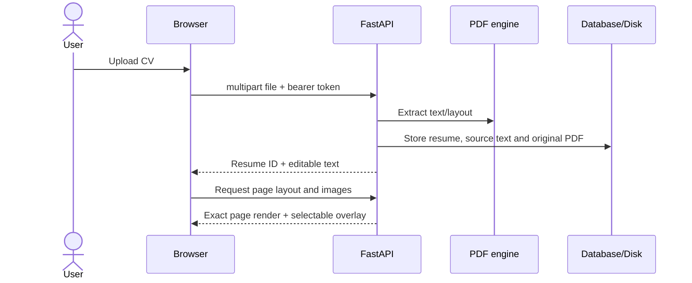
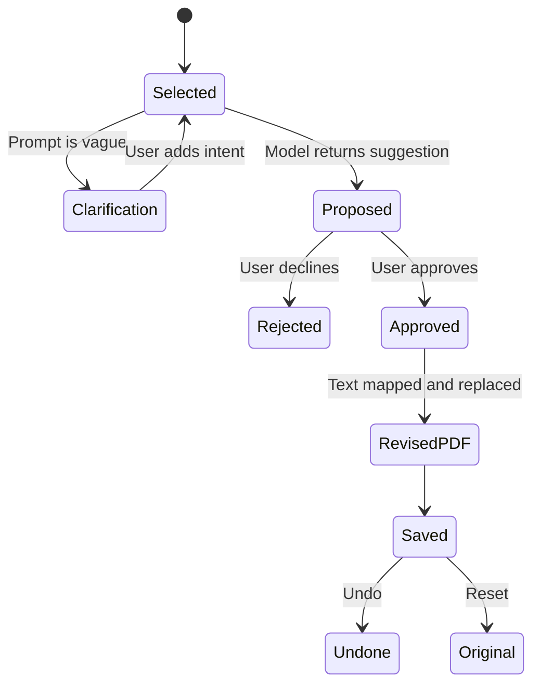

# Unibot Resume Agent — Master Technical Document

## 1. Executive summary

Unibot is a multi-tenant CV review system. A candidate uploads an existing document, receives an exact rendered PDF view plus editable extracted text, evaluates the resume against a job description, requests contextual edits, explicitly approves proposed changes, and downloads the resulting PDF.

The central product rule is **proposal before mutation**. AI output is treated as an untrusted suggestion. The user must approve it before the resume record or PDF changes.

## 2. Problem and impact

Placement candidates repeatedly tailor resumes for different roles, but typical keyword tools either hide their scoring logic or encourage inaccurate keyword stuffing. Unibot addresses this by:

1. showing the exact source resume;
2. explaining its scoring formula;
3. preserving candidate control over every AI change;
4. allowing direct editing of the visible PDF text layer;
5. retaining reset and undo paths;
6. keeping tenant data isolated in the backend.

## 3. System context



## 4. Container architecture



## 5. Primary user flows

### 5.1 Import and render



### 5.2 Proposal and approval



### 5.3 ATS suggestion to PDF

The analyzer returns missing terms but never inserts them automatically. Selecting a term stages a whole-CV command. The user confirms that the term is truthful, generates a proposal, reviews the target section, and approves the PDF change.

## 6. Data model

### User

- `id`: tenant identifier
- `email`: unique login or generated guest identity
- `password_hash`: PBKDF2-SHA256 hash
- `created_at`: audit timestamp

### Resume

- `id`, `user_id`, `title`
- `content`: JSON document containing extracted text and internal source/current PDF paths
- `created_at`, `updated_at`

### ResumeRevision

- `resume_id`
- immutable previous `content`
- human-readable mutation note
- timestamp

Every resume lookup verifies `resume.user_id == authenticated_user.id`; knowing another resume ID does not grant access.

## 7. ATS-readiness methodology

Unibot deliberately avoids claiming access to a hiring company’s ATS. The score is deterministic and inspectable:

```text
score = 0.70 × BM25 job relevance
      + 0.20 × evidence quality
      + 0.10 × resume structure
```

- **BM25 relevance:** Robertson term-frequency saturation over important job-description terms.
- **Evidence quality:** ratio of action-led and quantified accomplishment lines.
- **Structure:** coverage of education, experience, skills, and project sections.

References:

- Robertson and Zaragoza, *The Probabilistic Relevance Framework: BM25 and Beyond*: https://doi.org/10.1561/1500000019
- O*NET Content Model: https://www.onetcenter.org/content.html

## 8. AI behavior contract

The model is instructed to:

- change only the requested content;
- preserve names, dates, employers, metrics and facts;
- avoid inventing technologies or qualifications;
- return revised text without commentary.

Vague instructions such as “improve it” are intercepted before the model call and return a targeted clarifying question. Precise line edits and whole-CV changes produce proposals. Separate apply endpoints perform mutations only after approval.

## 9. PDF editing model

1. The source PDF is stored unchanged.
2. Pages are rendered to PNG for exact browser display.
3. An aligned transparent text layer makes lines and character ranges selectable.
4. Approved text is located using exact search followed by normalized layout-line matching.
5. The original rectangle is redacted and replacement text is inserted.
6. Bold source spans use a bold replacement font.
7. The result is saved as a new PDF revision; the previous file remains available through history/reset.

## 10. Security model

- JWT secrets and model credentials are server-side environment variables.
- Passwords are hashed; plaintext passwords are never stored.
- File size is capped at 8 MB.
- Supported extensions are explicitly checked.
- Tenant ownership is checked on every resume/PDF endpoint.
- Generated PDFs are returned through authenticated endpoints rather than public static URLs.
- Secrets and uploaded documents are excluded from Git.

Production hardening backlog: rate limiting, malware scanning, object-storage signed URLs, JWT revocation, refresh-token rotation, Alembic migrations, structured audit logs, and CSRF protection if cookie auth is introduced.

## 11. Failure handling

| Failure | User-visible behavior | Recovery |
|---|---|---|
| Expired guest token | Automatic fresh guest session | Retry request once |
| Local model offline | Explicit 503 message | Start Ollama or configure hosted model |
| Vague prompt | Clarifying question | Add intended outcome |
| Scanned PDF | No safe text replacement | OCR preprocessing required |
| Text cannot map to PDF | Editable draft retained; PDF unchanged | Choose a PDF-layer line or shorten scope |
| Long replacement | May not fit original box | Prefer concise proposal |
| Unwanted approved edit | Revision retained | Undo or reset original |

## 12. Observability and operations

- `/api/health` provides deployment health checks.
- GitHub Actions runs tests on pushes and pull requests.
- Database and PDF disk must be backed up together because records reference stored PDF revisions.
- Production logging should add request IDs, latency, model duration, PDF replacement result, and tenant-safe error metadata.

## 13. Repository map

```text
app/
  main.py          HTTP API and ownership boundaries
  ats.py           transparent scoring
  database.py      SQLAlchemy engine/session
  models.py        relational entities
  security.py      password hashing and JWT
  parser.py        file extraction
  llm.py           hosted/local model adapter
  pdf_editor.py    revision engine
  static/          browser application
tests/             API and PDF regression tests
docs/              architecture, testing and operations
render.yaml        production blueprint
docker-compose.yml local PostgreSQL stack
```

## 14. Roadmap

1. Alembic-managed schema migrations.
2. S3-compatible object storage and signed URLs.
3. OCR for scanned resumes.
4. O*NET API occupation lookup with cached technology/skill taxonomy.
5. DOCX layout-preserving output.
6. Semantic job/resume embeddings as a separately disclosed score component.
7. Evaluation dataset for hallucination, factual preservation and section-routing accuracy.
